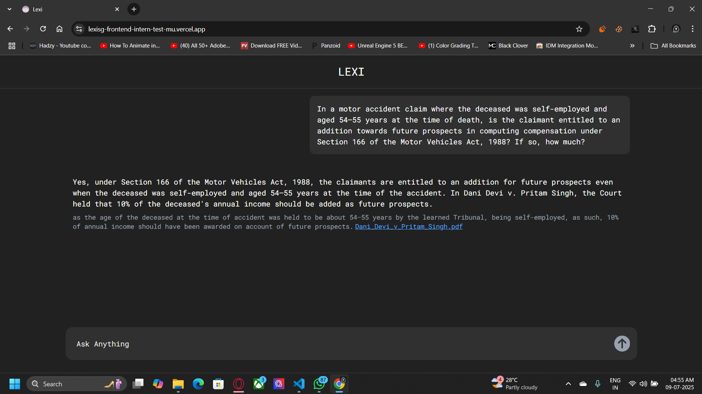
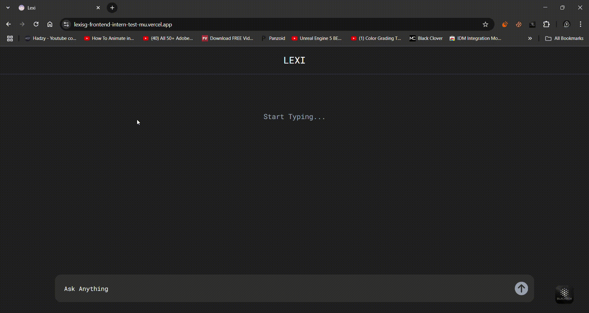

# Lexisg-frontend-intern-test

A minimal **ChatGpt-style legal assistant interface**, built with **Vite + React + Tailwind CSS**. It allows users to ask legal queries, view AI-generated answers with citations, and open cited PDFs in a popup.

This project simulates how Lexi links legal answers back to original source documents.

---

## 📸 Screenshot



---

## 🎥 Screen Recording



---

## 🚀 Live Demo

[🔗 Hosted Demo ](https://lexisg-frontend-intern-test-mu.vercel.app)

---

## ⚙️ Tech Stack

- ⚛️ **React** (with Vite)
- 🎨 **Tailwind CSS** for styling
- 📦 **React Icons** for icons
- 📄 **PDF Viewer Options**: Native, PDF.js (fallback), Google Docs (fallback)

---

## 📦 Project Structure

```
lexisg-frontend-intern-test/
├── public/
│   └── Dani.pdf
├── src/
│   ├── components/
│   │   ├── Header.jsx
│   │   ├── Body.jsx
│   │   ├── Pdf.jsx
│   │   └── InputQuery.jsx
│   ├── MainContext.jsx
│   ├── App.jsx
│   └── main.jsx
├── index.html
├── package.json
└── tailwind.config.js
```

---

## 🛠️ Getting Started

### 1. Clone the Repository

```bash
git clone https://github.com/HB936/Lexisg-frontend-intern-test.git
cd lexisg-frontend-intern-test
```

### 2. Install Dependencies

```bash
npm install
```

### 3. Start the Vite Dev Server

```bash
npm run dev
```

> App will be available at `http://localhost:5173` (or another port)

---

## 🧠 How Citation Linking Works

- When the user submits the legal query:
  - A **simulated API response** is generated using a `setTimeout`.
  - The answer and citation are shown in a chat-like format.

- Each citation contains:
  - Text snippet from the judgment.
  - Source file name and link to the PDF.
  - When clicked, the PDF opens in a **modal popup**, not a new tab.

- PDF Viewer supports three rendering options:
  - **Native** (default)
  - **PDF.js viewer** (Mozilla)
  - **Google Docs viewer**  
  *(User can switch manually if rendering fails)*

---

## ✅ Simulated Query and Response

**Query:**

```
In a motor accident claim where the deceased was self-employed and aged 54–55 years at the time of death, is the claimant entitled to an addition towards future prospects in computing compensation under Section 166 of the Motor Vehicles Act, 1988? If so, how much?
```

**Answer:**

```
Yes, under Section 166 of the Motor Vehicles Act, 1988, the claimants are entitled to an addition for future prospects even when the deceased was self-employed and aged 54–55 years at the time of the accident. In Dani Devi v. Pritam Singh, the Court held that 10% of the deceased’s annual income should be added as future prospects.
```

**Citation:**

```
“as the age of the deceased at the time of accident was held to be about 54–55 years by the learned Tribunal, being self-employed, as such, 10% of annual income should have been awarded on account of future prospects.” (Para 7)
```

---

## 📁 PDF Used

The citation opens the judgment PDF:  
[Dani_Devi_v_Pritam_Singh.pdf](https://lexisingapore-my.sharepoint.com/:b:/g/personal/harshit_lexi_sg/EdOegeiR_gdBvQxdyW4xE6oBCDgj5E4Bo5wjvhPHpqgIuQ?e=TEu4vz)

> This is embedded via iframe/object and opened on page 1 or others as provided by the backend.

---

## 📄 License

This project is open-source and free to use for assessment and demonstration purposes.
